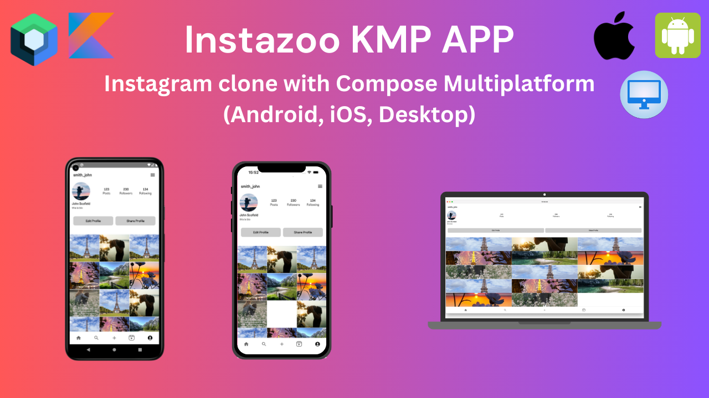

# Instazoo KMP App - An Instagram Clone Built with Compose Multiplatform

Click the image above to watch a YouTube demo of the Instazoo KMP App.

## Overview
Instazoo KMP is a clone of Instagram built with Compose Multiplatform. This app supports Android, iOS, and desktop platforms. The app fetches data from a static API hosted on GitHub Pages. The primary purpose of this app is to provide a hands-on experience with KMP Compose Multiplatform.

> **Note:**
> This app is still under development.

## Features

- Posts in a feed format with options to like, comment, and share.
- A horizontal list of stories on the home screen.
- Comments on each post can be viewed by opening the bottom sheet.
- The bottom navigation bar lets you switch between different app sections.
- The search section displays a staggered view of random items by default.
- The app has responsive loading for each request and image loading.
- User data such as name, bio, profile picture, followers, followings, and posts can be viewed.
- The profile screen displays user posts in a grid format.
- Custom Fonts
- Adjust both dark and light themes for better user experience.

# Technologies:

- Kotlin
- Clean Architecture
- Compose UI
- Network Requests
- Local Database
- Dependency Injection
- Compose Navigation

## Libraries 🛠️

- [Koin](https://insert-koin.io/) - Kotlin dependency injection library with multiplatform support.
- [Ktor](https://ktor.io/docs/http-client-multiplatform.html) - Provides multiplatform libraries required to make
  network calls to the REST API.
- [SQLDelight](https://cashapp.github.io/sqldelight/multiplatform_sqlite/) - Cross-Platform database library
- [kotlinx.coroutines](https://github.com/Kotlin/kotlinx.coroutines) - Library support for Kotlin coroutines with
  multiplatform support.
- [kotlinx.serialization](https://github.com/Kotlin/kotlinx.serialization) - Provides sets of libraries for various
  serialization formats eg. JSON, protocol buffers, CBOR etc.
- [Voyager](https://voyager.adriel.cafe/) - A Multiplatform navigation library
- [Kamel](https://github.com/Kamel-Media/Kamel) - Asynchronous media loading library for Compose Multiplatform
